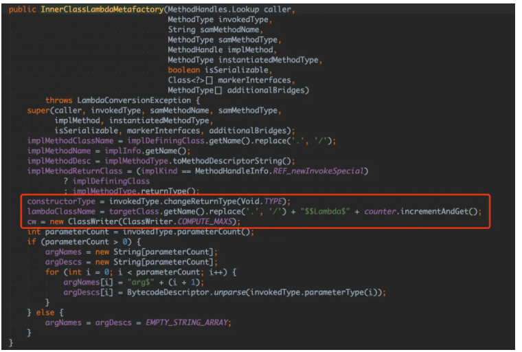

# 一、初识字节码

## 1、java文件如何变成 .class 文件


## 2、魔数 0xCAFEBABE

```class
xxd Hello.class 
00000000: cafe babe 0000 0034 0022 0a00 0600 1409  .......4."......
00000010: 0015 0016 0800 170a 0018 0019 0700 1a07  ................
00000020: 001b 0100 063c 696e 6974 3e01 0003 2829  .....<init>...()
00000030: 5601 0004 436f 6465 0100 0f4c 696e 654e  V...Code...LineN
00000040: 756d 6265 7254 6162 6c65 0100 124c 6f63  umberTable...Loc
00000050: 616c 5661 7269 6162 6c65 5461 626c 6501  alVariableTable.
00000060: 0004 7468 6973 0100 074c 4865 6c6c 6f3b  ..this...LHello;
```


* 这个魔数是 JVM 识别 .class 文件的标志，虚拟机在加载类文件之前会先检查这四个字节，如果不是 0xCAFEBABE 则拒绝加载该文件

## 3、javap 详解

```java
public class Hello {
    private String hello = "111";
    public String world = "222";
    public static void main(String[] args) {
        System.out.println("Hello, World");
    }
    private void sayHello() {
        System.out.println("Hello, World");
    }
}
```

### a)、 -c 选项

* 对类进行反编译

```java
Compiled from "Hello.java"
public class Hello {
  public Hello();
    Code:
       0: aload_0
       1: invokespecial #1                  // Method java/lang/Object."<init>":()V
       4: return

  public static void main(java.lang.String[]);
    Code:
       0: getstatic     #2  // Field java/lang/System.out:Ljava/io/PrintStream;
       3: ldc           #3  // String Hello, World
       5: invokevirtual #4  // Method java/io/PrintStream.println:(Ljava/lang/String;)V
       8: return
}
```

 3~7行: 可以看到虽然没有写 Hello 类的构造器函数，编译器会自动加上一个默认构造器函数
* 5行: aload_0 这个操作码是 aload_x 格式操作码中的一个。它们用来把对象引用加载操作数栈。 x 表示正在被访问的局部变量数组的位置。 在这里的0代表: 非静态的参数都有第一个默认参数this，这里的 aload_0 就是把this 入栈
* 6行: invokespecial #1，invokespecial 指令调用实例初始化方法、私有方法、父类方法，#1 指的是常量池中的第一个，这里是方法引用 java/lang/Object."\<init>":()V，也即构造器函数
* 7行: return，这个操作码属于ireturn、lreturn、freturn、dreturn、areturn 和 return 操作码组中的一员，其中 i 表示 int，返回整数，同类的还有 I 表示 long，f 表示 float，d 表示 double,  a 表示对象引用。没有前缀类型字母的 return 表示返回 void

以上是默认的构造器函数，接下来是 9 ~ 14 行的 main 函数

* 11行: getstatic #2，getstatic 获取指定类的静态域，并将其值压入栈顶，#2 代表常量池中的第 2 个，这里表示的是 java/lang/System.out:Ljava/io/PrintStream；，其实就是java.lang.System类的静态变量 out (类型是 PrintStream)

* 12行: ldc #3，ldc 用来将常量从运行时常量池压栈道操作数栈，#3 代表常量池的第三个(字符串 Hello，World)
* 13行: invokevirtual #4，invokevirtual 指令调用一个对象的实例方法，#4 表示PrintStream.printlin(String) 函数应用，并把栈顶两个元素出栈

过程如下图


### b)、 -p 选项

默认情况下，javap 会显示访问权限为 public、protected 和默认(包级 protected) 级别的方法，加上 -p 选项以后可以显示 private 方法和字段

  ```java
  Compiled from "Hello.java"
  public class Hello {
    private java.lang.String hello;
    public java.lang.String world;
    public Hello();
    public static void main(java.lang.String[]);
    private void sayHello();
  }
  ```

### c)、 -v 选项

javap 加上 -v 参数的输出更多详细的信息，比如栈大小、方法参数的个数

```java
Classfile /c:/Hello.class
  Last modified 2020-7-8; size 589 bytes
  MD5 checksum aca7aeab470adc51fe0eae48d7786eb4
  Compiled from "Hello.java"
public class Hello
  minor version: 0
  major version: 52
  flags: ACC_PUBLIC, ACC_SUPER
Constant pool:
   #1 = Methodref          #10.#23        // java/lang/Object."<init>":()V
   #2 = String             #24            // 111
   #3 = Fieldref           #9.#25         // Hello.hello:Ljava/lang/String;
   #4 = String             #26            // 222
   #5 = Fieldref           #9.#27         // Hello.world:Ljava/lang/String;
   #6 = Fieldref           #28.#29        // java/lang/System.out:Ljava/io/PrintStream;
   #7 = String             #30            // Hello, World
   #8 = Methodref          #31.#32        // java/io/PrintStream.println:(Ljava/lang/String;)V
   #9 = Class              #33            // Hello
  #10 = Class              #34            // java/lang/Object
  #11 = Utf8               hello
  #12 = Utf8               Ljava/lang/String;
  #13 = Utf8               world
  #14 = Utf8               <init>
  #15 = Utf8               ()V
  #16 = Utf8               Code
  #17 = Utf8               LineNumberTable
  #18 = Utf8               main
  #19 = Utf8               ([Ljava/lang/String;)V
  #20 = Utf8               sayHello
  #21 = Utf8               SourceFile
  #22 = Utf8               Hello.java
  #23 = NameAndType        #14:#15        // "<init>":()V
  #24 = Utf8               111
  #25 = NameAndType        #11:#12        // hello:Ljava/lang/String;
  #26 = Utf8               222
  #27 = NameAndType        #13:#12        // world:Ljava/lang/String;
  #28 = Class              #35            // java/lang/System
  #29 = NameAndType        #36:#37        // out:Ljava/io/PrintStream;
  #30 = Utf8               Hello, World
  #31 = Class              #38            // java/io/PrintStream
  #32 = NameAndType        #39:#40        // println:(Ljava/lang/String;)V
  #33 = Utf8               Hello
  #34 = Utf8               java/lang/Object
  #35 = Utf8               java/lang/System
  #36 = Utf8               out
  #37 = Utf8               Ljava/io/PrintStream;
  #38 = Utf8               java/io/PrintStream
  #39 = Utf8               println
  #40 = Utf8               (Ljava/lang/String;)V
{
  public java.lang.String world;
    descriptor: Ljava/lang/String;
    flags: ACC_PUBLIC

  public Hello();
    descriptor: ()V
    flags: ACC_PUBLIC
    Code:
      stack=2, locals=1, args_size=1
         0: aload_0
         1: invokespecial #1                  // Method java/lang/Object."<init>":()V
         4: aload_0
         5: ldc           #2                  // String 111
         7: putfield      #3                  // Field hello:Ljava/lang/String;
        10: aload_0
        11: ldc           #4                  // String 222
        13: putfield      #5                  // Field world:Ljava/lang/String;
        16: return
      LineNumberTable:
        line 1: 0
        line 2: 4
        line 3: 10

  public static void main(java.lang.String[]);
    descriptor: ([Ljava/lang/String;)V
    flags: ACC_PUBLIC, ACC_STATIC
    Code:
      stack=2, locals=1, args_size=1
         0: getstatic     #6                  // Field java/lang/System.out:Ljava/io/PrintStream;
         3: ldc           #7                  // String Hello, World
         5: invokevirtual #8                  // Method java/io/PrintStream.println:(Ljava/lang/String;)V
         8: return
      LineNumberTable:
        line 5: 0
        line 6: 8
}
SourceFile: "Hello.java"
```

### d)、 -s 选项

* 输出签名的类型描述符

```
javap -s Hello  
Compiled from "Hello.java"
public class Hello {
  public Hello();
    descriptor: ()V
  public static void main(java.lang.String[]);
    descriptor: ([Ljava/lang/String;)V
}
```

* 可以看到 main 函数的方法签名是 (Ljava/lang/String;)V。主要分为字段描述符和方法描述符

  * **字段描述符**，是一个表示类、实例或局部变量的语法符号，它的表示形式是紧凑的，比如 int 是用 I 表示的。

    | 描述符      | 类型                                        |
    | ----------- | :------------------------------------------ |
    | B           | byte                                        |
    | C           | char                                        |
    | D           | double                                      |
    | F           | Float                                       |
    | I           | Int                                         |
    | J           | Long                                        |
    | L ClassName | 应用类型(比如Ljava/lang/String; 用于字符串) |
    | S           | short                                       |
    | Z           | Boolean                                     |
    | [           | Array-of                                    |

  * **方法描述符** ，表示一个方法所需参数和返回值信息，表示形式为 （ParameterDescriptor* ）ReturnDescriptor。ParameterDescription 表示参数类型, ReturnDescriptor表示返回值信息，当没有返回值时用 V 表示。比如方法 Object foo(int i, double d, Thread t) 的描述符为 (IDLjava/lang/Thread;)Ljava/lang/Object

  

### e)、 -l 选项

* javac -g HelloWorld.java`以后重新执行`javap -l`命令就可以看到局部变量表

```java
javap -l HelloWorld
public static void main(java.lang.String[]);
LineNumberTable:
  line 3: 0
  line 4: 8
LocalVariableTable:
  Start  Length  Slot  Name   Signature
      0       9     0  args   [Ljava/lang/String;
```

# 二. class类文件解析

## 1、class 文件结构解析

* Java 虚拟机规定了 u1、u2、u4三种结构来表示 1、2、4 字节无符号整数，相同类型的若干条数据集合用表 (table) 的形式来存储。表示一个边长的结构，由代表长度的表头 (n) 和紧随着的 n 个数据项组成。class 文件采用类似 C 语言的结构体来存储数据

```
ClassFile {
      u4             magic;
      u2             minor_version;
      u2             major_version;
      u2             constant_pool_count;
      cp_info        constant_pool[constant_pool_count-1];
      u2             access_flags;
      u2             this_class;
      u2             super_class;
      u2             interfaces_count;
      u2             interfaces[interfaces_count];
      u2             fields_count;
      field_info     fields[fields_count];
      u2             methods_count;
      method_info    methods[methods_count];
      u2             attributes_count;
      attribute_info attributes[attributes_count];
  }
```

class 文件由线面是个部分组成

* 魔数（Magic Number）
* 版本号（Minor&Major Version）
* 常量池（Constant Pool）
* 类访问标记(Access Flags)
* 类索引（This Class）
* 超类索引（Super Class）
* 接口表索引（Interfaces）
* 字段表（Fields）
* 方法表（Methods）
* 属性表（Attributes）


### 1.1 魔数

* 使用文件名后缀来区分文件类型很不靠谱，后缀可以被随便修改
* **魔数**的作用：从文件内容本身来标识文件的类型呢

* 0xCAFEBABE 


### 1.2 版本号

* 在魔数之后的四个字节分别表示副版本号 (Minor Version) 和主版本号 (Major Version)


* 如果类文件的版本号高于 JVM 自身的版本号，加载该类会被直接抛出 java.lang.UnsupportedCalssVersionError 异常
* javap -v 可以方便查看类文件版本信息

### 1.3 常量池

* 对于 JVM 字节码来说，如果操作数非常小或者很常用的数字 0 之类的，这些操作数是内嵌到字节码中的。如果是字符串常量和较大的整数等，class 文件是把这些操作数存储在一个叫常量池 （Constant Pool）的地方，当使用这些操作数时，使用的是常量池数据中的索引位置。
* 常量池结构如下

```java
{
    u2             constant_pool_count;
    cp_info        constant_pool[constant_pool_count-1];
}
```

分为两部分

* 常量池大小 (cp_info_count)，常量池是 class 文件中第一个出现的变长结构。常量池大小由两个字节表示。常量池真正的有效索引是 1~ n-1，0 属于保留索引，用来表示不指向任何常量池项
* 常量池项 (cp_info) 集合，最多包含 n -1 个。为什么是最多呢？Long 和 Double 类型的常量会占用两个索引位置，如果常量池包含了这两种类型，实际的常量池项的元素个数比 n - 1 要小。
* 每个常量项都由两部分构成: 表示类型的 tag 和表示内容的字节数组

```
cp_info {
    u1 tag;
    u1 info[];
}
```

#### 1.3.1 CONSTANT_Integer_info、CONSTANT_Float_info

* CONSTANT_Integer_info 和 CONSTANT_Float_info 这两种结构分别用来表示 int 和 float 类型的常量

```java
CONSTANT_Integer_info {
    u1 tag;
    u4 bytes;
}

CONSTANT_Float_info {
    u1 tag;
    u4 bytes;
}
```

* boolean、byte、short 和 char  类型的变量，在常量池中都会被当做 int 来处理
* 以整型常量 18(0x12) 为例，它在常量池中的布局结构如下图所示：


#### 1.3.2 CONSTANT_Long_info 和 CONSTANT_Double_info

* CONSTANT_Long_info 和 CONSTANT_Double_info 这两种结构分别用来表示 long 和 double 类型的常量

```java
CONSTANT_Long_info {
    u1 tag;
    u4 high_bytes;
    u4 low_bytes;
}

CONSTANT_Double_info {
    u1 tag;
    u4 high_bytes;
    u4 low_bytes;
}
```


#### 1.3.3 CONSTANT_Utf8_info

* CONSTANT_Utf8_info 存储的时经过 MUTF(modified UTF-8) 编码的字符串

```java
CONSTANT_Utf8_info {
    u1 tag;
    u2 length;
    u1 bytes[length];
}
```

* 由三部分构成: 第一个字节是 tag，值为固定为1，tag 之后的两个字节 length 表示字符串的长度，第三部分是采用 MUTF-8 编码的长度字节为了length 的字节数组
* 以下是存储的字符串是"hello"


#### 1.3.4 CONSTANT_String_info 

* CONSTANT_String_info 用来表示 java.lang.String 类型的常量对象

```java
CONSTANT_String_info {
    u1 tag;
    u2 string_index;
}
```

* 第一个字节是 tag，值为8，tag 后面的两个字节是一个叫 string_index 的索引值，指向常量池中的 CONSTANT_Utf8_info，这个 CONSTANT_Utf8_info 中存储的才是真正的字符串常量
* 例如 String a = "hello"


#### 1.3.5 CONSTANT_Class_info

```java
CONSTANT_Class_info {
    u1 tag;
    u2 name_index;
}
```

*  由两部分组成，第一个字节是 tag, 值为7，tag 后面的两个字节 name_index 是一个常量池索引，指向类型为 CONSTANT_Utf8_info 常量


#### 1.3.6 CONSTANT_NameAndType_info

* CONSTANT_NameAndType_info 结构用来表示字段或者方法。由以下三部分组成
  * tag CONSTANT_NameAndType_info 结构 tag 的值为 12
  * name_index 指向常量池中的 CONSTANT_Utf8_info，存储的时字段名或者方法名
  * Descriptor_inde 也是指向常量池中的 CONSTANT_Utf8_info，存储的是字段描述符或者方法描述符
* 以如下方法示例

```java
public void testMethod(int id, String name) {
		
}
```

* CONSTANT_NameAndType_info 的结构示意图如下


#### 1.3.7 CONSTANT_Fieldref_info、CONSTANT_Methodref_info 和 CONSTANT_InterfaceMethodref_info

```java
CONSTANT_Fieldref_info {
    u1 tag;
    u2 class_index;
    u2 name_and_type_index;
}

CONSTANT_Methodref_info {
    u1 tag;
    u2 class_index;
    u2 name_and_type_index;
}

CONSTANT_InterfaceMethodref_info {
    u1 tag;
    u2 class_index;
    u2 name_and_type_index;
}
```

* 以 CONSTANT_Methodref_info 作为示例，表示类中的符号引用

```
方法 = 方法所属的类 + 方法名 + 方法参数及返回值描述符
```

* 由以下三部分组成
  * 第一个字节是tag : 10
  * 第二个部分是 class_index，指向 CONSTANT_Class_info 常量池的索引值
  * 第三部分是 name_and_type_index，指向 CONSTANT_NameAndType_info 常量池索引值，表示方法的参数类型和返回值的签名

```java
public class HelloWorldMain {
    public static void main(String[] args) {
        new HelloWorldMain().testMethod(1, "hi");
    }
    public void testMethod(int id, String name) {
    }
}

Constant pool:
   #2 = Class              #18            // HelloWorldMain
   #5 = Methodref          #2.#20         // HelloWorldMain.testMethod:(ILjava/lang/String;)V
  #20 = NameAndType        #13:#14        // testMethod:(ILjava/lang/String;)V
```


#### 1.3.8 CONSTANT_MethodType_info、CONSTANT_MethodHandle_info 和 CONSTANT_InvokeDynamic_info

* 从 JDK1.7 开始，为了更好支持动态语言的调用，新增了3种常量池类型
* 以下示例以 CONSTANT_InvokeDynamic_info ，主要为 invokedynamic 指令提供引导方法

```
CONSTANT_InvokeDynamic_info {
    u1 tag;
    u2 bootstrap_method_attr_index;
    u2 name_and_type_index;
}
```

* tag : 18
* bootstrap_method_attr_index : 指向引导方法表 bootstrap_methods[] 数组的索引
* name_and_type_index : 指向常量池里的 CONSTANT_NameAndType_info ，表示方法描述符

```java
public void foo() {
    new Thread (()-> {
        System.out.println("hello");
    }).start();
}
```

```java
Constant pool:
   #3 = InvokeDynamic      #0:#25         // #0:run:()Ljava/lang/Runnable;
   ...
  #25 = NameAndType        #37:#38        // run:()Ljava/lang/Runnable;

BootstrapMethods:
  0: #22 invokestatic java/lang/invoke/LambdaMetafactory.metafactory:(Ljava/lang/invoke/MethodHandles$Lookup;Ljava/lang/String;Ljava/lang/invoke/MethodType;Ljava/lang/invoke/MethodType;Ljava/lang/invoke/MethodHandle;Ljava/lang/invoke/MethodType;)Ljava/lang/invoke/CallSite;
    Method arguments:
      #23 ()V
      #24 invokestatic HelloWorldMain.lambda$foo$0:()V
      #23 ()V
```


### 1.4 类访问标记

*  用来标识一个类 是不是final、abstract等，由两个字节一共16位标识可供使用


### 1.5 类、超类、接口索引表

* 用来表示类的继承关系，this_name 标识类索引、super_name 标识父类索引、interface 标识类或接口的父接口
* 本例中 this_class 为 0x0005，指向常量池中下标为 5 的元素，这个元素是由两部分组成，第一部分是类型，这里是 Class 表示是一个类，第二部分是指向常量池下标 21 的元素，这个元素是字符串 "HelloWorldMain"。


### 1.6 字段表

* 类中定义的字段会被存储到这个集合中，包括类中定义的静态和非静态字段，不包括方法定义的内部变量

```
{
    u2             fields_count;
    field_info     fields[fields_count];
}
```

* 由两部分组成
  * 字段数量（fields_count）：字段表也是一个变长的结构，类中定义的若干个字段的个数会被存储到字段数量里。
  * 字段集合（fields）：字段集合是一个类数组的结构，共有 fields_count 个，对应类中定义的若干个字段，每一个字段 field_info 的结构会在下面介绍。


##### 1.6.1 字段 field_info 结构

```
field_info {
    u2             access_flags; 
    u2             name_index;
    u2             descriptor_index;
    u2             attributes_count;
    attribute_info attributes[attributes_count];
}
```

* access_flags：表示字段的访问标记，是 public、private 还是 protected，是否是 static，是否是 final 等。
* name_index：字段名的索引值，指向常量池的的字符串常量。
* descriptor_index：字段描述符的索引，指向常量池的字符串常量。
* attributes_count、attribute_info：表示属性的个数和属性集合。

##### 1.6.2 字段访问标记


##### 1.6.3 字段描述符


##### 1.6.4 字段属性 

* 与字段相关的属性有下面这几个：ConstantValue、Synthetic 、Signature、Deprecated、RuntimeVisibleAnnotations 和 RuntimeInvisibleAnnotations 这六个，比较常见的是 ConstantValue 这属性，用来表示一个常量字段的值

### 1.7 方法表 

* 类中定义的方法会被存储在该集合中，与字段表一样，方法表也是一个变长集合

```
{
    u2             methods_count;
    method_info    methods[methods_count];
}
```

##### 1.7.1 方法 method_info 结构

```
method_info {
    u2             access_flags;
    u2             name_index;
    u2             descriptor_index;
    u2             attributes_count;
    attribute_info attributes[attributes_count];
}
```

* 由以下四部分组成
* access_flags：表示方法的访问标记，是 public、private 还是 protected，是否是 static，是否是 final 等。
* name_index：方法名的索引值，指向常量池的的字符串常量。
* descriptor_index：方法描述符的索引，指向常量池的字符串常量。
* attributes_count、attribute_info：表示方法相关属性的个数和属性集合，包含了很多有用的信息，比如方法内部的字节码就是存放在 Code 属性中。

##### 1.7.2 方法访问标记


##### 1.7.3 方法名与描述符

* 方法名: 方法名索引 name_index，指向常量池中 CONSTANT_Utf8_info 类型的字符串常量
* 描述符

```
(参数1类型 参数2类型 参数3类型 ...)返回值类型
```


##### 1.7.4 方法属性表

* 前面介绍了方法的访问标记、方法签名，还有一些重要的信息没有出现，如方法声明抛出的异常，方法的字节码，方法是否被标记为 deprecated，这些信息存在哪里呢？这就是方法属性表的作用。跟方法相关的属性有很多，其中重要的是 Code 和 Exceptions 属性，其中 Code 属性存放方法体的字节码指令，Exceptions属性 用于存储方法声明抛出的异常

### 1.8 属性表

* 属性出现的地方比较广泛，不止出现在字段和方法中，在顶层的 class 文件中也会出现。
* 相比于常量池只有 14 种固定的类型，属性表是的类型是更加灵活的，不同的虚拟机实现厂商可以自定义自己的属性。 属性表的结构如下所示

```
{
    u2             attributes_count;
    attribute_info attributes[attributes_count];
}
```

##### 1.8.1 ConstantValue 属性

* ConstantValue 属性只会出现字段 field_info 中，表示静态变量的初始值

```
ConstantValue_attribute {
    u2 attribute_name_index;
    u4 attribute_length;
    u2 constantvalue_index;
}
```

* 其中 attribute_name_index 是指向常量池中值为 "ConstantValue" 的常量项，ConstantValue 属性的 attribute_length 值恒定为 2，constantvalue_index 指向常量池中具体的常量值索引，根据变量的类型不同 constantvalue_index 指向不同的常量项

* 以`public static final int DEFAULT_SIZE = 128;`为例，字段对应的 class 文件如下图高亮部分


##### 1.8.1 Code 属性

* 包含了所有方法的字节码

```java
Code_attribute {
    u2 attribute_name_index;
    u4 attribute_length;
    u2 max_stack;
    u2 max_locals;
    u4 code_length;
    u1 code[code_length];
    u2 exception_table_length;
    {   u2 start_pc;
        u2 end_pc;
        u2 handler_pc;
        u2 catch_type;
    } exception_table[exception_table_length];
    u2 attributes_count;
    attribute_info attributes[attributes_count];
}
```

* 以下是详细描述
  * 属性名索引（attribute_name_index）占两个字节，指向常量池中 CONSTANT_Utf8_info 常量，表示属性的名字，比如这里对应的常量池的字符串常量"Code"。
  * 属性长度（attribute_length）占用两个字节，表示属性值大小
  * max_stack 表示操作数栈的最大深度，方法执行的任意期间操作数栈的深度都不会超过这个值。它的计算规则是有入栈的指令 stack 增加，有出栈的指令 stack 减少，在整个过程中 stack 的最大值就是 max_stack 的值，增加和减少的值一般都是 1，但也有例外：LONG 和 DOUBLE 相关的指令入栈 stack 会增加 2，VOID 相关的指令则为 0。
  * max_locals 表示局部变量表的大小，它的值并不是等于方法中所有局部变量的数量之和。当一个局部作用域结束，它内部的局部变量占用的位置就可以被接下来的局部变量复用了。
  * code_length 和 code 用来表示字节码相关的信息，其中 code_length 表示字节码指令的长度，占用 4 个字节。code 是一个长度为 code_length 的字节数组，存储真正的字节码指令。
  * exception_table_length 和 exception_table 用来表示代码内部的异常表信息，如我们熟知的 try-catch 语法就会生成对应的异常表。
  * attributes_count 和 attributes[] 用来表示 Code 属性相关的附属属性，Java 虚拟机规定 Code 属性只能包含这四种可选属性：LineNumberTable、LocalVariableTable、LocalVariableTypeTable、StackMapTable。以LineNumberTable 为例，LineNumberTable 用来存放源码行号和字节码偏移量之间的对应关系，这 LineNumberTable 属于调试信息，不是类文件运行的必需的属性，默认情况下都会生成。如果没有这两个属性，那么在调试时没有办法在源码中设置断点，也没有办法在代码抛出异常的时候在错误堆栈中显示出错的行号信息

* 示例:

```java
public static void main(String[] args) {

    try {
        foo();
    } catch (NullPointerException e) {
        System.out.println();
    } catch (IOException e) {
        System.out.println();
    }

    try {
        foo();
    } catch (Exception e) {
        System.out.println();
    }
}
```


## 2.2 字节码概述

字节码  = 操作码 + 操作数

# 三、字节码原理 —— 基于栈的执行引擎

## 1、stack based vs registed based

* 虚拟机常见的实现方式有两种：Stack based 和 Register based

* 举例 c = a + b
* 基于 HotSpot JVM 的源码和字节码如下

```java
void bar(int a, int b) {
    int c =  a + b;
}

对应字节码
0: iload_1 // 将 a 压入操作数栈
1: iload_2 // 将 b 压入操作数栈
2: iadd    // 将栈顶两个值出栈，相加，然后将结果放回栈顶
3: istore_3 // 将栈顶值存入局部变量表中第 3 个 slot 中
```

* 基于寄存器的 LuaVM  的 lua 源码和字节码如下，查看字节码使用 luac -l -l -v -s test.lua 命令

```
local function my_add(a, b)
	return a + b;
end

对应字节码
1	[3]	ADD      	2 0 1
```

* 基于寄存器的 add 指令直接把寄存器 R0 和 R1 相加，结果保存在寄存器 R2 中
* 基于栈和基于寄存器的过程对比如下


* 基于栈的指令集一致性更好，代码更加紧凑、编译器更加简单，但完成相同功能所需的指令数一般比寄存器架构多，需要频繁的入栈出栈，栈架构指令集的执行速度会相对而言慢一些。

## 2、栈帧

* 栈帧是用于支持虚拟机进行方法调用和方法执行的数据结构。栈帧随着方法调用而创建，随着方法结束而销毁，栈帧的存储空间分配在 Java 虚拟机栈中。
* 每个栈帧拥有自己的局部变量表、操作数栈和指向运行时常量池的引用

### a)、局部变量表

* 局部变量表的大小在编译期间就已经确定
* Java虚拟机使用局部变量表来完成方法调用时的参数传递

### b)、操作数栈

* 栈的大小同样是在编译期间确定
* Java 虚拟机提供的一些字节码指令用来从局部变量表或者对象实例的字段中复制常量或者变量到操作数栈，也有一些指令用于从操作数栈取走数据、操作数据和操作结果重新入栈

整个 JVM 指令执行的过程就是局部变量表与操作数栈之间不断load、store的过程


### 例子:

```java
public class ScoreCalculator {
    public void record(double score) {
    }

    public double getAverage() {
        return 0;
    }
}
public static void main(String[] args) {
    ScoreCalculator calculator = new ScoreCalculator();

    int score1 = 1;
    int score2 = 2;

    calculator.record(score1);
    calculator.record(score2);

    double avg = calculator.getAverage();
} 
```

字节码如下:

```java
public static void main(java.lang.String[]);
descriptor: ([Ljava/lang/String;)V
flags: ACC_PUBLIC, ACC_STATIC
Code:
  stack=3, locals=6, args_size=1
     0: new           #2                  // class ScoreCalculator
     3: dup
     4: invokespecial #3                  // Method ScoreCalculator."<init>":()V
     7: astore_1
     
     8: iconst_1
     9: istore_2
     
    10: iconst_2
    11: istore_3
    
    12: aload_1
    13: iload_2
    14: i2d
    15: invokevirtual #4                  // Method ScoreCalculator.record:(D)V
    
    18: aload_1
    19: iload_3
    20: i2d
    21: invokevirtual #4                  // Method ScoreCalculator.record:(D)V
    
    24: aload_1
    25: invokevirtual #5                  // Method ScoreCalculator.getAverage:()D
    28: dstore        4
    
    30: return
```

* 0 ~ 7 : 新建了一个 ScoreCalculator 对象，使用 astore_1 存储在局部变量 calculator 中: astore_1的含义是把栈顶的值存储到局部变量表下标为 1 的位置上
* 8 ~ 11 : iconst_1 和 iconst_2 用来将整数 1 和 2 加载到栈顶，istore_2 和 istore_3 用来将栈顶的元素存储到局部变量表 2 和 3的位置上
* 12 ~ 15 : 可以看到 store 指令会把栈顶元素移除，所以下次我们要用到这些局部变量时，需要使用 load 命令重新把它加载到栈顶。比如我们要执行 calculator.record(score1)，对应的字节码如下

```java
12: aload_1
13: iload_2
14: i2d
15: invokevirtual #4 // Method ScoreCalculator.record:(D)V
```

可以看到 aload_1 先从局部变量表中1的位置加载 calculator 对象，iload_2 从局部变量表中2的位置加载一个整型值，i2d 这个指令用来将整型值转为 double 并将新的值重新入栈，到目前位置参数全部就绪，可以用 invokevirutal 执行方法调用了

* 24 ~ 28 : 同样是一个普通的方法调用，流程还是先 aload_1 加载 calculator 对象，invokevirtual 调用 getAverage 方法，并将栈顶元素存储到局部变量表下标为4的位置上

## 3、从二进制看 class 文件和字节码

* 手动用 16 进制编辑器去修改这些字节码文件，比较容易出错，所以产生了一些字节码操作的工具，最出名的莫过于 ASM 和 Javassist

# 四、字节码指令之控制转移 —— for 与 switch

## 1、字节码指令分类

* 加载和存储指令，比如 iload 将一个整型值从局部变量表加载到操作数栈
* 控制转移指令，比如条件分值 ifeq
* 对象操作，比如创建类实例的指令 new
* 方法调用，比如 invokevirtual 指令用于调用对象的实例方法
* 运算指令和类型转换，比如加法指令 iadd
* 线程同步，monitorenter 和 monitorexit 两条指令来支持 synchronized 关键字的语义
* 异常处理，比如 athrow 显示抛出异常

## 2、控制转移指令

* 控制转移指令根据条件进行分值跳转，我们常见的if-then-else、三目表达式、for 循环、异常处理等都属于这个范畴。对应的指令集包括
  * 条件分支: ifeq、iflt、ifle、ifne、ifgt、ifnull、ifnonnull、if_icmpeq、if_icmpne、ificmplt、if_icmpgt、if_icmple、if_icmpge、if_acmpeq 和 if_acmpne
  * 复合条件分分支: tableswitch、loopupswitch
  * 无条件分支: goto、goto_w、jsr、jsr_w、ret
* for 循环例子

```java
public class MyLoopTest {
    public static int[] numbers = new int[]{1, 2, 3};
    public static void main(String[] args) {
        ScoreCalculator calculator = new ScoreCalculator();
        for (int number : numbers) {
            calculator.record(number);
        }
    }
}
```

对应的字节码:

```java
public static void main(java.lang.String[]);
Code:
   0: new           #2                  // class ScoreCalculator
   3: dup
   4: invokespecial #3                  // Method ScoreCalculator."<init>":()V
   7: astore_1
   
   8: getstatic     #4                  // Field numbers:[I
  11: astore_2
  12: aload_2
  13: arraylength
  14: istore_3
  15: iconst_0
  16: istore        4
  
  18: iload         4
  20: iload_3
  21: if_icmpge     43
  24: aload_2
  25: iload         4
  27: iaload
  28: istore        5
  30: aload_1
  31: iload         5
  33: i2d
  34: invokevirtual #5  // Method ScoreCalculator.record:(D)V
  
  37: iinc          4, 1
  40: goto          18
 
  43: return
```

局部变量表:


* 8 ~ 16: 是初始化循环控制变量的一个过程。加载静态变量数组引用，存储到局部变量下标为2的位置上，记为 \$array，aload_2 加载 \$array 到栈顶，调用 arraylength 指令获取数据长度存储到栈顶，随后调用 istore_3 将数组长度存储到局部变量表中第3个位置，记为 \$len。iconst_0 将整型值 0 加载到栈顶，随后将它存储到局部变量表第 4 个位置，记为 $i，写为伪代码如下

```
$array = numbers;
$len = $array.arraylength
$i = 0
```

* 18 ~ 34: 是真正的循环体。首先加载 \$i 和 \$len 到栈顶，然后调用 if_icmpge 进行比较，如果 \$i >  $len，直接跳转到指令43，也就是 return，函数结束。如果 \$i < \$len，执行循环体，加载 \$array、\$i，然后 iaload 指令把下标为 \$i 的数组元素加载到操作数栈上，随后存储到局部变量表下标为 5 的位置上，记为 \$item。随后调用 invokevirtual 指令来执行 record 方法
* 37 ~ 40: 执行循环后的 \$i 自增操作

```
@start: if ($i >= $len) return;
$item = $array[$i]
++ $i
goto @start
```

## 3、switch 底层实现

* switch-case 的底层实现，实际上编译器将使用 tableswitch 和 loopupswitch 两个指令来生成 switch 语句的编译代码

```
int chooseNear(int i) {
    switch (i) {
        case 100: return 0;
        case 101: return 1;
        case 104: return 4;
        default: return -1;
    }
}

字节码如下：

0: iload_1
1: tableswitch   { // 100 to 104
         100: 36
         101: 38
         102: 42
         103: 42
         104: 40
     default: 42
}

36: iconst_0   // return 0
37: ireturn
38: iconst_1   // return 1
39: ireturn
40: iconst_4   // return 4
41: ireturn
42: iconst_m1  // return -1
43: ireturn
```

* 代码中的 case 中并没有出现 102、103，在字节码中出现了。编译器对 case 的值做分析，如果 case 的值比较紧凑，中间有少量断层或者没有断层，会采用 tableswitch 来实现 switch-case，有断层的会生成一些虚假的 case 帮忙补齐连续，这样可以实现 O(1) 事件复杂度的查找: 因为 case 已经被补齐为连续的，通过游标就可以一次找到

伪代码如下

```
int val = pop();                // pop an int from the stack
if (val < low || val > high) {  // if its less than <low> or greater than <high>,
    pc += default;              // branch to default 
} else {                        // otherwise
    pc += table[val - low];     // branch to entry in table
}
```

* case 值断层严重的例子

```
int chooseFar(int i) {
    switch (i) {
        case 1: return 1;
        case 10: return 10;
        case 100: return 100;
        default: return -1;
    }
}

对应字节码

0: iload_1
1: lookupswitch  { // 3
           1: 36
          10: 38
         100: 41
     default: 44
}
```

* 如果还是采用上面那种 tableswitch 补齐的方式，就会生成上百个假 case，class 文件也爆炸式增长，这种做法显然不合理。loopupswitch 的键值是经过排序的，在查找上可以采用二分查找的方式，事件复杂度为 O(log n)

# 五、字节码指令之对象初始化——new，\<init> & \<clinit>

## 1、new，\<init> & \<clinit>

```java
ScoreCalculator calculator = new ScoreCalculator();

对应的字节码如下

0: new           #2                  // class ScoreCalculator
3: dup
4: invokespecial #3                  // Method ScoreCalculator."<init>":()V

7: astore_1
```

* 一个对象创建的过程: new、dup、invokespecial
* 类的构造器函数是以 \<init> 函数名出现的，被称为实例的初始化方法。调用 new 指令时，只要创建了一个类的实例，但是还没有调用构造器函数，使用 invokespecial 调用了 \<init> 后才真正调用了构造器函数，正是因为需要调用这个函数才导致必须要有一个 dup 指令，不然调用完 \<init> 函数以后，操作数为空，就再也找不回刚刚创建的对象。


* \<init> 调用构造器函数，\<clinit> 是类的静态初始化比 \<init> 调用得更早一些，\<clinit> 不会直接被调用，在下面四个指令触发调用: new，getstatic， putstatic or invokestatic。也就是，初始化一个类实例、访问一个静态变量或者一个静态方法，类的初始化方法就会被触发

## 2、相关面试题分析

```java
public class A {
    static {
        System.out.println("A init");
    }
    public A() {
        System.out.println("A Instance");
    }
}

public class B extends A {
    static {
        System.out.println("B init");
    }
    public B() {
        System.out.println("B Instance");
    }
}
```

* 问题：`B[] arr = new B[10]` 会输出什么？
* 数组的初始化指令

```
bipush 10
anewarray 'B'
astore 1
```

* anewarray 接收栈顶的元素 (数组的长度)，新建一个数组引用。由此可见新建一个 B 的数组没有触发任何类或者实例的初始化操作

## 3、思考题

```java
class Father {
    private int i = test();
    private static int j = method();
    static {
        System.out.print("(1)");
    }
    Father() {
        System.out.print("(2)");
    }
    {
        System.out.print("(3)");
    }
    public int test() {
        System.out.print("(4)");
        return 1;
    }
    public static int method() {
        System.out.print("(5)");
        return 1;
    }
}
public class Son extends Father {
    private int i = test();
    private static int j = method();
    static {
        System.out.print("(6)");
    }
    Son() {
        System.out.print("(7)");
    }
    {
        System.out.print("(8)");
    }
    public int test() {
        System.out.print("(9)");
        return 1;
    }
    public static int method() {
        System.out.print("(10)");
        return 1;
    }
    public static void main(String[] args) {
        Son s1 = new Son();
        System.out.println();
        Son s2 = new Son();
    }
}
```

* 初始化顺序: （父类静态变量 => 父类静态块)(有先后顺序) => 子类静态变量 => 子类静态块 => 父类实例变量 => 父类代码块 => 父类初始化方法 => 子类实例变量 => 子类代码块 => 子类初始化方法
* 如果调用静态方法，不会涉及到多态，在那个类中调用静态方法，优先找本类，否则搜索父类，再搜索父类，如果在父接口找不到则报错
* 如果调用实例方法，会动态分派，动态解析，只用实际类型的实例方法

# 六、字节码指令之方法调用

* invokestatic: 用于调用静态方法
* invokespecial: 用于调用私有实例方法、构造器，以及使用 super 关键字调用父类的实例方法或构造器，和所实现接口的默认方法
* invokevirtual: 用于调用非私有化实例方法
* invokeinterface: 用于调用接口方法
* Invokedynamic: 用于调用动态方法

## 1、方法的静态绑定与动态绑定

* Java 的两种方法绑定方式: 静态绑定与动态绑定。在编译时能确定目标方法叫做静态绑定；在运行时根据调用者的类型动态识别的叫动态绑定
* Invokestatis 和 invokespecial 这两个指令对应的方法时静态绑定的，invokestatic 调用的是类的静态方法，在编译期确定，运行期不会改变。剩下的三个都属于动态绑定

## 2、invokestatic

* invokestatic 用来调用静态方法，即使用 static 关键字修饰的方法。它要调用的方法在编译期间确定，运行期不会修改，属于静态板顶。它也是所有静态方法调用指令里面最快的

## 3、invokevirtual vs invokespecial

* invokevirtual: 用来调用 public、protected、package 访问级别的方法
* invokespecial: 包括实例构造方法、私有方法（private 修饰的方法）和父类的方法（即 super 关键字调用的方法）。这些方法可以直接确定实际执行的方法的实现，与 invokestatic 一样，也属于静态绑定
* invokevirtual 用在方法要根据对象类型不同动态选择的情况，在编译期不确定

## 4、invokeinterface vs invokevirtual

* invokeinterface 用于调用接口方法，在运行时再确定一个实现此接口的对象

```java
class A {
    public void method1() { }
    public void method2() { }
    public void method3() { }
}

class B extends A {
    public void method2() { } // overridden from BaseClass
    public void method4() { }
}
```


* 现在 B类的虚方法保留了父类 A中方法的顺序，只是覆盖了 method2() 指向的函数连接和新增了 method4()。假设这时需要调用 method2() 方法，invokevirtual 只需要直接取找虚方法表位置2 的函数应用即可

```java
interface X {
    void methodX()
}
class B extends A implements X {
    public void method2() { } // overridden from BaseClass
    public void method4() { }
    public void methodX() { }
}
Class C implements X {
    public void methodC() { }
    public void methodX() { }
}
```


* 这种情况下，B 类的MethodX 在位置5的地方，C类的 methodX 在位置为 2 的地方，如果要用 invokevirtual 调用 methodX 就不能直接从固定的虚方法表索引位置拿到对应的方法连接。
* invokeinteface 不得不搜索整个虚方法来找到对应方法，效率上远不如 invokevirtual

# 七、用HSDB来探究多态实现的原理

## 1、HSDB基础

* HSDB 全称是: Hotspot Debugger，是内置的 JVM 工具，可用来深入分析 JVM 运行时的内部状态。HSDB 位于 JDK 安装目录的 lib/sa-jdi.jar 中。启动 HSDB

```
sudo java -cp sa-jdi.jar sun.jvm.hotspot.HSDB
```


启动 =》 Tools (类列表、堆信息、inspect对象内存、死锁检测)

## 2、利用HSDB来看多态的基础 vtable(??为什么要叫vtable)

vtable 是 Java 实现多态的基石，如果一个方法被继承和重写，会把 vtable 中指向父类的方法指针指向子类自己的实现

* Java 子类会继承父类的 vtable。Java 所有的类都会继承 java.lang.Object 类，Object 类有 5 个虚方法可以被继承和重写。当一个类不包含任何方法时，vtable 的长度也最小为5，标识 Object 类的 5个虚方法
* final 和 static 修饰的方法不会被放到 vtable 方发表里
* 当子类重写了父类方法，子类 vtable 原本指向父类的方法指针会被替换为子类的方法指针
* 子类的 vtable 保持了父类的 vtable 顺序

# 八、invokedynamic 指令解读

## 1、MethodHandle 是什么

* MethodHandle 称为方法句柄或方法指针
* 使得 Java 可以像其他语言一样把函数当做参数进行传递

```java
public class Foo {
  	public void print(String s) {
      	System.out.println("hello, " + s);
    } 
  	public static void main(String[] args) throws Throwable {
      	Foo foo = new Foo() {
          	MethodType methodType = MethodType.methodType(void.class, String.class);
          	MethodHandle methodHandle = MethodHandles.loopup().findVirtual(Foo.class, "print", methodType);
          	methodHandle.invokeExact(foo, "world");
        }
    }
}
```

* 使用 MethodHandle 方法的步骤如下所示
  * 1）创建 MethodType 对象，MethodType 用来表示方法签名，每个MethodHandle 都有一个 MethodType 实例，用来指定方法的返回值类型和各个参数类型
  * 2）调用 MethodHandles.lookup 静态方法返回 MethodHandle.Lookup 对象，这个对象表示查找的上下文，根据方法的不同类型通过 findStatic、findSpecial、findVirtual 等方法查找方法签名为 MethodType 的方法句柄
  * 3）拿到方法句柄以后就可以调用具体的方法了，通过放入目标方法参数，使用 invoke 或 invokeExact 进行方法的调用

## 2、什么是invokedynamic

* Invokedynamic 则把如何查找目标方法的决定权从虚拟机下放到具体的用户代码中
* 调用流程如下:
  * JVM 首次当执行 invokedynamic 指令时会调用引导方法
  * 引导方法返回 CallSite 对象，CallSite 内部根据方法签名进行目标方法查找。它的 getTarget 方法返回方法句柄（MethodHandle）对象。
  * 在 CallSite 没有变化的情况下，MethodHandle 可以一直被调用，如果 CallSite 有变化的话重新查找即可


# 九、匿名内部类与 lambda

## 1、测试匿名内部类的实现

```java
Test.java
public static void main(String[] args) {   
     Runnable r1 = new Runnable() {
        @Override
        public void run() {
            System.out.println("hello, inner class");
        }
    };
    r1.run();
}
```

* 使用 javac 进行编译会生成两个 class 文件 Test.class 和 Test$1.class

* main 函数简化过的字节码如下:

```
public static void main(java.lang.String[]);
Code:
  stack=2, locals=2, args_size=1
     0: new           #2                  // class Test$1
     3: dup
     4: invokespecial #3                  // Method Test$1."<init>":()V
     7: astore_1
     8: aload_1
     9: invokeinterface #4,  1            // InterfaceMethod java/lang/Runnable.run:()V
    14: return
```

* 第 0 ~ 7 行: 新建 Test$1 实例对象
* 第 8 ~ 9 行: 执行 Test$1 对象的 run 方法

```java
class Test$1 implements Runnable {
    public Test$1(Test test) {
    }

    @Override
    public void run() {
        System.out.println("hello, inner class");
    }
}
public class Test {
    public static void main(String[] args) {
        Runnable r1 = new Test$1(this);
        r1.run();
    }
}
```

* 匿名内部类是编译器间生成新的 class 文件实现的

## 2、测试lambda表达式

```java
public static void main(String[] args) {
    Runnable r = ()->{
        System.out.println("hello, lambda");
    };
    r.run();
}
```

* 使用 javac 编译，发现只生成了 Test.class 一个类文件，并没有生成匿名内部类，使用 javap -p -s -c -v -l Test 查看对应字节码如下

```
public static void main(java.lang.String[]);
descriptor: ([Ljava/lang/String;)V
flags: ACC_PUBLIC, ACC_STATIC
Code:
  stack=1, locals=2, args_size=1
     0: invokedynamic #2,  0              // InvokeDynamic #0:run:()Ljava/lang/Runnable;
     5: astore_1
     6: aload_1
     7: invokeinterface #3,  1            // InterfaceMethod java/lang/Runnable.run:()V
    12: return

private static void lambda$main$0();
Code:
     0: getstatic     #4                  // Field java/lang/System.out:Ljava/io/PrintStream;
     3: ldc           #5                  // String hello, lambda
     5: invokevirtual #6                  // Method java/io/PrintStream.println:(Ljava/lang/String;)V
     8: return
```

* 出现了一个名为 lambda\$main\$0 的静态方法

```java
private static void lambda$main$0() {
    System.out.println("hello, lambda");
}
```

* 第 0 行中 #2 标识常量池中 #2，它有指向了 #0:#23

```
Constant pool:
   #1 = Methodref          #8.#18         // java/lang/Object."<init>":()V
   #2 = InvokeDynamic      #0:#23         // #0:run:()Ljava/lang/Runnable;
   ...
   #23 = NameAndType        #35:#36        // run:()Ljava/lang/Runnable;

BootstrapMethods:
  0: #20 invokestatic java/lang/invoke/LambdaMetafactory.metafactory:(Ljava/lang/invoke/MethodHandles$Lookup;Ljava/lang/String;Ljava/lang/invoke/MethodType;Ljava/lang/invoke/MethodType;Ljava/lang/invoke/MethodHandle;Ljava/lang/invoke/MethodType;)Ljava/lang/invoke/CallSite;
    Method arguments:
      #21 ()V
      #22 invokestatic Test.lambda$main$0:()V
      #21 ()V
```

* 其中 #0 是一个特殊的查找，对应 BootstrapMethods 中的 0 行，可以看到这是一个对静态方法 LambdaMetafactory.metafactory() 的调用，它的返回值时 java.lang.invoke.CallSite 对象，这个对象代表了真正执行的目标方法调用

* 核心的 metafactory 函数定义如下

```java
public static CallSite metafactory {
  MethodHandles.Lookup caller,
  String invokedName,
  MethodType invokedType,
  MethodType samMethodType,
  MethodHandle implMethod,
  MethodType instantiatedMethodType
}
```

* caller: JVM 提供的查找上下文
* invokedName: 标识调用函数名，在本例中 invokedName 为 "run"
* sameMethodType: 函数式接口定义的方法签名 (参数类型和返回值类型)，本例中为 run 方法的签名 "()void"
* implMethod：编译时生成的 lambda 表达式对应的静态方法 inovkestatic Test.lambda\$main\$0
* instantiatedMethodType: 一般和 samMethodType 是一样或是它的一个特例，在本例中是 "()void"

* metafactory 方法的内部细节是整个 lambda 表达式最复杂的地方. 源码如下


* 跟进 InnerClassLambdaMetafactory 类，看到它在摸摸生成新的内部类，类名的规则是 ClassName?Lambda1，其中 ClassName 是 lambda 所在的类名，后面的数字按生成的顺序依次递增




* 可以通过以下方法打印具体生成的类名

```java
Runnable r = ()->{
    System.out.println("hello, lambda");
};

System.out.println(r.getClass().getName());

输出：
Test$$Lambda$1/1108411398
```

* 其中斜杆 / 后面的数字 1108411398 是类队形的 hashcode 值
* nnerClassLambdaMetafactory 这个类的静态初始化方法里有一个开关可以选择是否把生成的类 dump 到磁盘中

```java
// For dumping generated classes to disk, for debugging purposes
private static final ProxyClassesDumper dumper;
static {
        final String key = "jdk.internal.lambda.dumpProxyClasses";
        String path = AccessController.doPrivileged(
                new GetPropertyAction(key), null,
                new PropertyPermission(key , "read"));
        dumper = (null == path) ? null : ProxyClassesDumper.getInstance(path);
    }
```

* 使用 java -Djdk.internal.lambda.dumpProxyClasses=. Test 运行 Test类会发现在运行期间生成了一个新的内部类: Test?Lambda$1.class。这个类是由 InnerClassLambdaMetafactory 使用 ASM 字节码结束动态生成的，只是默认情况下看不到而已
* 这个类实现了 Runnable 接口，并在 run 方法里调用了 Test 类的静态方法 lambda\$main\$0()，类似如下代码

```java
final class Test?Lambda$1 implements Runnable {
    @Override
    public void run() {
        Test.lambda$main$0();
    }
}
```

* 整体过程如下:
  * lambda 表达式声明的地方会生成一个 invokedynamic 指令，同时编译器生成一个对应的引导方法 (Bootstrap Method)
  * 第一次执行 invokedynamic 指令时，会调用对应的引导方法 (Bootstrap Method)，该引导方法会调用 LambdaMetafactory.metafactory 方法动态生成内部类
  * 引导方法会返回一个动态调用 CallSite 对象，这个 CallSite 会链接最终调用的实现了 Runnable 接口的实现类
  * lambda 表达式中的内容会被编译成静态方法，前面动态生成的内部类会直接调用该静态方法
  * 真正执行 lambda 调用的还是用 invokeinterface 指令 

## 3、为什么Java8的Lambda表达式要基于invokedynamic

* invokedynamic 与 之前四个 invoke 指令最大的不同就在于它把方法分派的逻辑从虚拟机层面下放到程序语言。lambda 表达式采用的方式是不在编译期间就生成匿名内部类，而是提供了一个稳定的字节码二进制标识规范，对用户而言看到的只有 invokedynamic 这样一个简单的指令。用 invokedynamic 来实现就是把翻译的逻辑隐藏在 JDK 的实现中，后续想替换实现方法非常简单，只用修改 LambdaMetafactory.metafactory 里的逻辑即可， 这种方法把 lambda 翻译的策略由编译期间推迟到运行时。w

# 十、字节码角度分析面试题 ——i++ 、 ++i 区别

## 1、字节码分析笔试题

```java
public static void foo() {
    int i = 0;
    for (int j = 0; j < 50; j++)
        i = i++;
    System.out.println(i);
}
```

* 字节码 javap -v 得到如下

```
public static void foo();
     0: iconst_0
     1: istore_0
     2: iconst_0
    
     3: istore_1
     4: iload_1
     5: bipush        50
     7: if_icmpge     21
     
    10: iload_0
    11: iinc          0, 1
    14: istore_0
    
    15: iinc          1, 1
    18: goto          4
    
    21: getstatic     #3                  // Field java/lang/System.out:Ljava/io/PrintStream;
    24: iload_0
    25: invokevirtual #4                  // Method java/io/PrintStream.println:(I)V
    28: return
```

* 对应 i = i++ 的字节码是 10 ~ 14 行
  * 10 : iload_0 把局部变量白哦 slot = 0 的变量 (i) 加载到 操作数栈上
  * 11 : iinc 0,1 对局部变量表 slot = 0 的变量 (i) 直接加 1，但是这时候栈顶的元素没有变化，还是0
  * 14 : istore_0 把栈顶元素出栈复制给局部变量表 slot = 0 的变量，也就是 i。在这时，局部变量 i 又被复制为0了，前面的 iinc 指令对 i 的加一操作前功尽弃。


## 2、++i 又会是怎样

```java
public static void foo() {
    int i = 0;
    for (int j = 0; j < 50; j++)
        i = ++i;
    System.out.println(i);
}
```

* 对应字节码如下 javap -v

```
public static void foo();
     0: iconst_0
     1: istore_0
     2: iconst_0
     3: istore_1
     4: iload_1
     5: bipush        50
     7: if_icmpge     21
     
    10: iinc          0, 1
    13: iload_0
    14: istore_0
    
    15: iinc          1, 1
    18: goto          4
    21: getstatic     #3                  // Field java/lang/System.out:Ljava/io/PrintStream;
    24: iload_0
    25: invokevirtual #4                  // Method java/io/PrintStream.println:(I)V
    28: return
```

* 可以看出 i = ++i 先对局部变量表 slot = 0 的变量加1，然后才把它加载到操作数栈上，随后又从操作数栈上出栈赋值给局部变量表，最后写回去的值也是最新的值


## 3、更难的题目

```java
public static void bar() {
    int i = 0;
    i = i++ + ++i;
    System.out.println("i=" + i);
}
```

* add 指令的第一个参数值为0，第二个参数值为2，最终输出的结果为2

```java
public static void bar();
     0: iconst_0
     1: istore_0
     
     2: iload_0
     3: iinc          0, 1
     6: iinc          0, 1
     9: iload_0
    10: iadd
    11: istore_0
```


# 十一、字节码角度看语法糖 -- String 的 switch实现

## 1、switch String 的 demo

* switch-case 依据 case 值的稀疏程度，分别有两个指令 tableswitch 和 loopupswitch，但这个两个指令都只成支持整型值。而 switch-case 支持 String类型的值

```java
public int test(String name) {
    switch (name) {
        case "Java":
            return 100;
        case "Kotlin":
            return 200;
        default:
            return -1;
    }
}
```

* javap -v 字节码如下:

```java
 0: aload_1
 1: astore_2
 2: iconst_m1
 3: istore_3
 
 4: aload_2
 5: invokevirtual #2                  // Method java/lang/String.hashCode:()I
 8: lookupswitch  { // 2
     -2041707231: 50 // 对应 "Kotlin".hashCode()
         2301506: 36 // 对应 "Java".hashCode()
         default: 61
    }
    
36: aload_2
37: ldc           #3                  // String Java
39: invokevirtual #4                  // Method java/lang/String.equals:(Ljava/lang/Object;)Z
42: ifeq          61
45: iconst_0
46: istore_3
47: goto          61

50: aload_2
51: ldc           #5                  // String Kotlin
53: invokevirtual #4                  // Method java/lang/String.equals:(Ljava/lang/Object;)Z
56: ifeq          61
59: iconst_1
60: istore_3

61: iload_3
62: lookupswitch  { // 2
               0: 88
               1: 91
         default: 95
    }
    
// 88 ~ 90
88: bipush        100
90: ireturn

91: sipush        200
94: ireturn

95: iconst_m1
96: ireturn
```

* 局部变量表如下: 


* 0 ~ 3: 做一些初始化操作，把入参 name 赋值给局部变量表下标为 2 的变量，记为 tmpName, 初始化局部变量表 3 位置的变量为 -1，记为 matchIndex
* 4 ~ 8: 对 tmpName 调用了 hashCode 函数，得到一个整型值。因为一般而言 hash 都比较离散，所以没有选用 tableswitch 而是用 loopupswitch 来作为 switch case 的实现
* 36 ~ 47: 如果 hashCode dengyu  "Kotlin".hashCode() 会跳转到这部分字节码。首选把字符串进行真正意义上的 equals 比较，看是否相等，是否相等使用的是 ifeq 指令， ifeq 的含义是 ifeq 0 则跳转到对应字节码行出，实际上是等于 false 跳转。这里如果相等则把 matchIndex 赋值为0
* 61 ~ 96: 进行最后的 case 分值执行

## 2、 hashCode 冲突如何处理

* 比如 "Aa" 和 ”BB“ 的 hashCode 都是2112

```java
public int testSameHash(java.lang.String);
descriptor: (Ljava/lang/String;)I
flags: ACC_PUBLIC
Code:
  stack=2, locals=4, args_size=2
     0: aload_1
     1: astore_2
     2: iconst_m1
     3: istore_3
     
     4: aload_2
     5: invokevirtual #2                  // Method java/lang/String.hashCode:()I
     8: lookupswitch  { // 1
                2112: 28
             default: 53
        }
        
    28: aload_2
    29: ldc           #3                  // String BB
    31: invokevirtual #4                  // Method java/lang/String.equals:(Ljava/lang/Object;)Z
    34: ifeq          42
    37: iconst_1
    38: istore_3
    39: goto          53
    
    42: aload_2
    43: ldc           #5                  // String Aa
    45: invokevirtual #4                  // Method java/lang/String.equals:(Ljava/lang/Object;)Z
    48: ifeq          53
    51: iconst_0
    52: istore_3
    
    53: iload_3
    54: lookupswitch  { // 2
                   0: 80
                   1: 83
             default: 87
        }
    80: bipush        100
    82: ireturn
    83: sipush        200
    86: ireturn
    87: iconst_m1
    88: ireturn
```

* 可以看到 34 行在 hashCode 冲突的情况下，JVM 的处理不过是多一次字符串相等的比较。与 "BB" 不相等的情况，会在继续判断是否等于 "Aa"

# 十二、try catch finally 为啥 finally 语句一定会执行

## 1、try catch 字节码分析

```java
public class TryCatchFinallyDemo {
  	public void foo() {
      	try {
          	tryItOut1();
        } catch (MyException e) {
          	handleException(e);
        }
    }
}
```


* 在编译后字节码中，每个方法都附带一个异常表（Exception table），异常表里的每一行标识一个异常处理器，由 from 指针、to 指针、target 指针、所捕获的异常类型 type 组成。这些指针的值是字节码索引，用于定位字节码，其含义是在 [from，to) 字节码范围内，抛出了异常类型为 type 的异常，就会跳转到 target 表示的字节码处。比如，上面的例子异常表表示: 在 0 到 4 中间（不包含4）如果抛出了 MyException1 的异常，就跳转到 7 执行。

* 当有多个的 catch 的情况下

```java
public void foo() {
    try {
        tryItOut2();
    } catch (MyException1 e) {
        handleException1(e);
    } catch (MyException2 e) {
        handleException2(e);
    }
}
```

* 对应字节码如下:


* 当程序出现异常时，Java 虚拟机会从上至下遍历异常表中所有的条目，当触发异常的字节码索引值在某个异常的 [from，to) 范围内，则会判断抛出的异常与该条目想捕获的异常是否匹配
  * 如果匹配，Java 虚拟机会将控制流转跳转到 target 指向的字节码；如果不匹配则继续遍历异常表
  * 如果遍历完所有的异常表，还未匹配到异常处理器，那么该异常将蔓延到调用方 (caller) 中重复上述的操作。最坏的情况下虚拟机需要遍历该线程 Java 栈上所有方法的异常表

## 2、finally 字节码分析

```java
public void foo() {
    try {
        tryItOut1();
    } catch (MyException1 e) {
        handleException(e);
    } finally {
        handleFinally();
    }
}
```

* 对应的字节码如下:


* 字节码包含了三份 finally 语句块，都在程序正常 return 和 异常 throw 之前。其中两处在 try 和 catch 调用 return 之前，一处是在异常 throw 之前
* Java  采用方式是复制 finally 代码块的内容，分别放在 try catch 代码块所有正常 return 和异常 throw 之前。

## 3、面试题解析

```java
题目1：
public static int func() {
    try {
        return 0;
    } catch (Exception e){
        return 1;
    } finally {
        return 2;
    }
}
返回 2

题目2：
public static int func() {
    try {
        int a = 1 / 0;
        return 0;
    } catch (Exception e) {
        return 1;
    } finally {
        return 2;
    }
}
返回 2

题目3：
public static int func() {
    try {
        int a = 1 / 0;
        return 0;
    } catch (Exception e) {
        int b = 1 / 0;
    } finally {
        return 2;
    }
}
返回 2
```

# 十三、字节码角度看 try with resource 语法糖 -- 资源释放不用慌

```java
public static void foo() throws Exception {

    AutoCloseable c = null;
    try {
        c = dummy();
        bar();
    } finally {
        if (c != null) {
            c.close();
        }
    }
}
```

* 如果 bar() 抛出了异常 e1，c.close() 也抛出了异常 e2

```
public static void foo() {
    try {
        throw new RuntimeException("in try");
    } finally {
        throw new RuntimeException("in finally");
    }
}
```

* 运行调用 foo() 最终抛出异常: <font color="red">Exception in thread "main" java.lang.RuntimeException: in finally</font>
* try 中抛出的异常，就被 finally 中抛出的异常淹没掉了

## 1、suppressed 异常是什么

* 如果 bar() 和 c.close() 同时抛出了异常，那么调用端应该会受到 c.close() 抛出的异常 e2. 那么怎么样抛出 try 中的异常，同时又不丢掉 finally 中的异常？

> Java 7 中 为 `Throwable` 类 增 加 的 `addSuppressed` 方 法。当 一 个异 常 被 抛 出 的 时 候 , 可 能 有 其 他 异 常 因 为 该 异 常 而 被 抑 制 住 , 从 而 无 法 正 常 抛 出 。这时 可 以 通 过`addSuppressed` 方 法 把 这 些 被 抑 制 的 方 法 记 录 下 来 。 被 抑 制 的 异 常 会 出 现在 抛 出 的 异 常 的 堆 栈 信 息 中 , 也 可 以 通 过 `getSuppressed` 方 法 来 获 取 这 些 异 常 。 这 样做 的 好 处 是 不 会 丢 失 任 何 异 常 , 方 便 开 发 人 员 进 行 调 试 。

```java
public static void foo() throws Exception {
    AutoCloseable c = null;
    Exception tmpException = null;
    try {
        c = dummy();
        bar();
    } catch (Exception e) {
        tmpException = e;
        throw e;
    } finally {
        if (c != null) {
            if (tmpException != null) {
                try {
                    c.close();
                } catch (Exception e) {
                    tmpException.addSuppressed(e);
                }
            } else {
                c.close();
            }
        }
    }
}
```


# 十四、字节码细数 Kotlin 优雅的语法糖


# 十五、深入分析 Kotlin 1.2 处理 when 语法的超级大 bug


# 十六、字节码角度看 synchronized -- 窥探加锁解锁的细节

## 1、代码块级别的 synchronized

```java
private Object lock = new Object();
public void foo() {
    synchronized (lock) {
        bar();
    }
}

public void bar() { }
```

* 编译成字节码如下:

```java
public void foo();
    Code:
       0: aload_0
       1: getfield      #3                  // Field lock:Ljava/lang/Object;
       4: dup
       5: astore_1
       
       6: monitorenter
       
       7: aload_0
       8: invokevirtual #4                  // Method bar:()V
       
      11: aload_1
      12: monitorexit
      13: goto          21
      
      16: astore_2
      17: aload_1
      18: monitorexit
      19: aload_2
      20: athrow
      21: return
    Exception table:
       from    to  target type
           7    13    16   any
          16    19    16   any
```

* Java 虚拟机中代码块的同步是通过 monitorenter 和 monitorexit 两个支持 synchronized 关键字语意的。比如上面的字节码

* 0 ~ 5: 将 lock 对象入栈，使用 dup 指令复制栈顶元素，并将它存入局部变量表位置1 的地方，现在站上还剩下一个 lock 对象
* 6: 以栈顶元素 lock 做为锁，使用 monitorenter 开始同步
* 7 ~ 8: 调用 bar() 方法
* 11 ~ 12: 将 lock 对象入栈，调用 monitorexit 释放锁
* 16 ~ 20: 执行异常处理，字节码会帮忙加上 try-catch 的逻辑。因为编译器必须保证，无论同步代码块中的代码以何种方式结束 (正常 return 或者异常退出)，代码中每次调用 monitorenter 必须执行对对应的 monitorexit 指令。为了保证这一点，编译器会自动生成一个异常处理器，这个异常处理器的目的就是为了同步代码块抛出异常时能执行 monitorexit。这也是字节码中，只有一个 monitorenter 却有两个 monitorexit 的原因

* 可理解为如下代码

```java
public void _foo() throws Throwable {
    monitorenter(lock);
    try {
        bar();
    } finally {
        monitorexit(lock);
    }
}
```

* 根据 try-catch-finally 的字节码实现原理，等价于

```java
public void _foo() throws Throwable {
    monitorenter(lock);
    try {
        bar();
        monitorexit(lock);
    } catch (Throwable e) {
        monitorexit(lock);
        throw e;
    }
}
```

## 2、方法级的 synchronized

* 方法及的同步，是由常量池中方法的 ACC_SYNCHRONIZED 标志来隐式实现的

```java
synchronized public void testMe() {
}

对应字节码

public synchronized void testMe();
descriptor: ()V
flags: ACC_PUBLIC, ACC_SYNCHRONIZED
```

* JVM 不会使用特殊的字节码来调用同步方法，当 JVM 解析犯法的符号引用时，它会判断方法是不是同步的 (检查方法 ACC_SYNCHRONIZED 是否被设置)。如果是，执行线程会先尝试获取锁。如果是实例方法，JVM 会先尝试获取实例对象的锁，如果是类方法，JVM 会尝试获取类锁。在同步方法完成以后，不管是正常返回还是异常返回，都会释放锁

# 十七、万恶的擦除

## 1、当泛型遇到重载

```java
public void print(List<String> list)  { }
public void print(List<Integer> list) { }
```

* 上述代码编译的时候会报错，提示 name clash: print(List\<Integer>) and print(List\<String>) have the same erasure
* 这两个函数对应的字节码都是

```java
descriptor: (Ljava/util/List;)V
Code:
  stack=0, locals=2, args_size=2
     0: return
  LocalVariableTable:
    Start  Length  Slot  Name   Signature
        0       1     0  this   LMyClass;
        0       1     1  list   Ljava/util/List;
}
```

## 2、泛型的核心概念: 类型擦除(type erasure)

* Java 的泛型是在 javac 编译期这个级别实现的。在生成的字节码中，已经不包含类型信息。这种在泛型使用时机上类型参数，在编译时被抹掉的过程被称为泛型擦除。
* 比如在代码中定义: List\<String> 与 List\<Integer> 在编译以后都变成了 List。JVM 看到只是 List，而 JVM 不允许相同签名的函数在一个类中同时存在，所以上面代码中编译无法通过
* 由泛型附加的类型信息对 JVM 来说是不可见的。Java 编译器会在编译时尽可能的发现可能出错的地方，但也不是万能的。

## 3、泛型真的被完全擦除了吗

* 在 javac 编译的时候加上 -g 参数生成更多的调试信息，使用 javap -c -v -l 来查看字节码时可以看到更多有用的信息

```java
  public void print(java.util.List<java.lang.String>);
    descriptor: (Ljava/util/List;)V
      stack=0, locals=2, args_size=2
         0: return
      LocalVariableTypeTable:
        Start  Length  Slot  Name   Signature
            0       1     1  list   Ljava/util/List<Ljava/lang/String;>;
    Signature: #18                          // (Ljava/util/List<Ljava/lang/String;>;)V
```

* LocalVariableTypeTable 和 Signature 是针对泛型引入的新的属性，用俩解决泛型的参数类型识别问题， Signature 的作用是存储一个方法在字节码层面的特征签名，这个属性保存的不是原生类型，而是包括了参数化类型的信息。我们依然可以通过反射的方式拿到参数的类型。所谓的擦除，只是把方法 code 属性的字节码进行擦除

# 十八、深入理解反射实现的原理


# 十九、Javac 源码调试和原理解析

## 1、Javac 编译原理简介

### a)、 Javac 源码调试


# 二十、 JVM的寄生插件 javaagent 那些事

## 1、Java Instrumentation 包

### a)、 Java Instrumentation 概述

* 很多工具是基于 Instreumetation 来实现的
  * APM 产品: pinpoint、skywalking、newrelic、听云的 APM 产品都基于 Instrumentation 实现
  * 热部署工具: Intelljj 的 HotSwap、Jrebel 等
  * Java 诊断工具: Arthas、Btrace 等。

* 由于对字节码修改功能的巨大需求，JDK 从 JDK5 版本开始引入了 java.lang.instrument 包。它可以通过 addTransformer 方法设置一个 ClassFileTransformer，可以在这个 ClassFileTransformer 实现类的转换
* JDK 1.5 支持静态 Instrumentation，基本的思路是在 JVM 启动的时候添加一个代理 (javaagent)，每个代理是一个 jar 包，其 MANIFEST.MF 文件里指定了代理类，这个代理类包含一个 premain 方法。JVM 在类加载会先执行代理类的 premain 方法，再执行 java 程序本身的 main 方法，这就是 premain 名字的来源。在 premain 方法中科院对加载前的 class 文件进行修改。这种机制科院认为是虚拟机级别的 AOP，无需对原有应用做任何修改，就可以实现类的动态修改和增强。

### b)、Java Instrumenttation 核心方法

* Instrumentation 是 java.lang.instrument 包下的一个接口，这个接口的方法提供了注册类文件转换器、获取所有已加载的类等功能，允许我们在对已加载和未加载的类进行修改，实现  AOP 、性能监控等功能
* 常用的方法如下: 

```java
/**
 * 为 Instrumentation 注册一个类文件转换器，可以修改读取类文件字节码
 **/
void addTransofrmer(ClassFileTranformer transformer, boolean canRetransform);

/**
 * 对 JVM 已经加载的类重新出发类加载
 **/
void retranformerClasses(Class<?>... classes) throws UnmodifableClassException;

/**
 * 获取当前 JVM 加载的所有类对象
 **/
Class[] getAllLoadedClasses()
```

* 它的 addTransformer 给 Instrumentation 注册一个 transformer,  transformer 是 ClassFileTransformer 接口的实例，这个接口就只有一个 transform 方法，调用 addTransformer 设置 transformer 以后，后续 JVM 加载所有类之前都会被这个 transformer 方法拦截，这个方法接收原类文件的字节数组，返回转换过的字节数组，这个方法中可以做任意的类文件改写
* 下面是一个空的 ClassFileTransformer 的实现:

```java
public class MyClassTransformer implements ClassFileTransformer {
  @Override
  public byte[] transform(ClassLoader loader, String className, Class<?> classBeingRedefined, ProtectionDomain protectionDomain, byte[] classBytes) throws IllegalClassFormatException {
    // 在这里读取、转换类文件
    return classBytes;
  }
}
```

## 2、Javaagent 介绍

* Javaagent 是一个特殊的 jar 包，它不能单独启动的，而必须依附于一个 JVM 进程，可以看做是 JVM 的一个寄生插件，使用 Instrumentation 的 API 用来读取和改写当前 JVM 的类文件。

### a)、Agent的两种使用方式

*  在 JVM 启动的时候加载，通过 javaagent 启动参数 java -javaagent:myagent.jar MyMain，这种方式在程序 main 方法执行之前 agent 中的 premain 方法
* 在 JVM 启动后 Attach，通过 Attach API 进行加载，这种方式会在 agent 加载以后执行 agentmain 方法
* premain 和 agentmain 方法签名如下:

```java
public static void premain(String agentArgument, Instrumentation instrumentation) throws Exception

public static void agentmain(String agentArgument, Instrumentation instrumentation) throws Exception
```

* 这两个方法都有两个参数
  * 第一个 agentArgument 是 agent 的启动参数，可以在 JVM 启动命令行设置，比如 java -javaagent:\<jarfile>=appId:agent-demo,agentType:singleJar test.jar 的情况下，agentArgument 的值为 "appId:agent-demo,agentType:singleJar"
  * 第二个 instrumentation 是 java.lang.instrument.instrumentation 的实例，可以通过 addTransformer 方法设置一个 ClassFileTransformer
* 第一种 premain 方法的加载时序如下:


### b)、Agent 包

*  为了能够以 javaagent 的方式运行 premain 和 agentmain 方法，我们需要将其打包成 jar 包，并在其中的 MANIFEST.MF 配置文件中，指定 Premain-class 等信息，一个典型的生成好的 MANIFEST.MF 内容

```java
Premain-Class: me.geek01.javaagent.AgentMain
Agent-Class: me.geek01.javaagent.AgentMain
Can-Redefine-Classes: true
Can-Retransform-Classes: true
```

* 下面是一个可以帮助生成上面 MAINIFEST.MF 的 maven 配置

```xml
<build>
  <finalName>my-javaagent</finalName>
  <plugins>
    <plugin>
      <groupId>org.apache.maven.plugins</groupId>
      <artifactId>maven-jar-plugin</artifactId>
      <configuration>
        <archive>
          <manifestEntries>
            <Agent-Class>me.geek01.javaagent.AgentMain</Agent-Class>
            <Premain-Class>me.geek01.javaagent.AgentMain</Premain-Class>
            <Can-Redefine-Classes>true</Can-Redefine-Classes>
            <Can-Retransform-Classes>true</Can-Retransform-Classes>
          </manifestEntries>
        </archive>
      </configuration>
    </plugin>
  </plugins>
</build>
```

## 3、Agent 使用方式之一: JVM 启动参数

* 使用 javaagent 实现简单的函数调用栈跟踪，下面代码为例:

```java
public class MyTest {
    public static void main(String[] args) {
        new MyTest().foo();
    }
    public void foo() {
        bar1();
        bar2();
    }

    public void bar1() {
    }

    public void bar2() {
    }
}
```

* 通过 javaagent 启动参数的方式在每个函数进入和结束都打印一行日志，实现调用过程的追踪的效果。

## 4、 Agent 使用方式之二: Attach API 使用

### a)、JVM Attach API 基本使用

### b)、JVM Attach API 的底层原理

# 二十一、工业级的字节码改写框架 ASM 与 Javassist

## 1、 ASM 

*  ASM 使用了访问者（Visitor）设计模式，避免了创建和消耗大量的中间变量
* 

## 2、Javassist


# 二十二、ASM 在 cglib 与 fastjson 上的应用

## 1、cglib 的简单应用

## 2、fastjson

* 通过 ASM 自动生成序列号、反序列化字节码，减少反射开销，理论上可以提高 20% 的性能

 # 二十三、破解软件-直接修改字节码

## 1、常用工具

##  2、破解方式

# 二十四、无痛破解 Java系软件

## 1、换个花样破解

核心思路是通过 javaagent 和 ASM 来进行字节码改写，在类加载之前修改字节码逻辑

## 2、破解gceasy


# 二十五、APM简介与分布式跟踪的基本原理

## 1、什么是APM

## 2、分布式跟踪理论基础

每个请求都生成全局唯一的 Trace ID／Span ID，端到端透传到上下游所有的节点，通过 Trace ID 将不同系统的孤立的调用日志和异常日志串联在一起，同时通过 Span ID、ParentId 表达节点的父子关系

## 3、单JVM调用链路跟踪实现原理

spanId 做为当前调用id，parentId 做为父调用 id，traceId 做为整条链路 id

## 4、扩进程、异构系统的调用链路跟踪如何处理

# 二十六、一个可落地的APM整体架构

## 1、架构概览

## 2、Agent上报

## 3、数据收集服务

## 4、数据处理端

数据处理可以分为三大部分：流水查询、实时告警、离线报表分析


# 二十七、APM字节码注入的代码实现

## 1、使用更强大AdviceAdapter来生成try-catch-finally 语句块

### a)、onMethodEnter

### b)、onMethodExit

### c)、visitMaxs

### d)、visitTryCatchBlock 与 visitLabel


## 2、获取特定的上下文信息


## 3、跨进程链路调用的实现


## 4、代码仓库

> https://github.com/arthur-zhang/geek01/tree/master/javaagent-demo